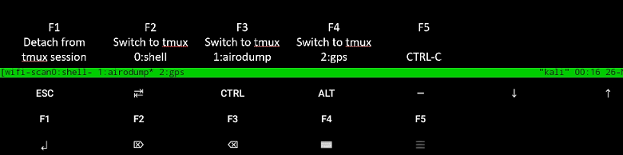
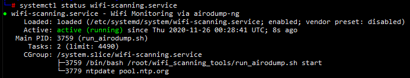

# Portable Wifi Scanning

Turns a Raspberry Pi device into a portable wifi scanning unit and creates an access point for remote access.  

# Description 
This project was developed to facilite passive wifi data collection activities.  The Pi and all the USB devices can be placed in a backpack.  Using a tablet with Termux installed, you can connect to the access point hosted on the Pi, attach to the tmux session, and monitor the airodump-ng collection.   

The project uses a GPS device, two ALFA AC1200 wifi adapters for wifi scanning, and a TP-LINK USB wifi adapter as an access point.  

NTP is configured to use the GPS as a time source.  This allows the device to keep accurate time when storing first and last seen times of access points and their clients.  

[airodump-ng](https://www.aircrack-ng.org/doku.php?id=airodump-ng) is the tool of choice to conduct passive wifi scanning.  One ALFA card is configured to channel hop on the 2.4GHz spectrum and the other channel hops on the 5.0GHz spectrum.  Each airodump-ng instance is also configured to use the GPS device.    gpsmon and airodump-ng are started in a tmux session so that we can attach to the session from our mobile device. tmux allows to attach and detach as needed, while the processes continue run.  The commands in the script to run airodump-ng are:
 - 5.0GHz: `airodump-ng --gpsd -w <filename prefix> --band a --manufacture <ALFA AC1200 device>`
 - 2.4GHz: `airodump-ng --gpsd -w <filename prefix> --band bg --manufacture <ALFA AC1200 device>`

[hcxdumptool](https://github.com/ZerBea/hcxdumptool) is used to collect [PMKIDs](https://hashcat.net/forum/thread-7717.html).  hcxdumptool is configured in a passive-only mode for data collection.  In this configuration only one ALFA card is used and the gps device.  The command in the script to run hcxdumptool is:
 - `hcxdumptool -o <filename.pcapng> -i <ALFA AC1200 device> --enable_status 1 --disable_client_attacks --disable_deauthentication --use_gpsd`  

Termux is installed on our tablet with a custom touch keyboard.  The F1-F5 keys are configured to cycle through the tmux windows, detach from the tmux session, and Ctrl-C out of programs.  

The software can be install either on the Kali OS or the Raspbian OS.

# Requirements
## Hardware 

 - [TP-Link TL-WN725N](https://www.amazon.com/TP-Link-wireless-network-Adapter-SoftAP/dp/B008IFXQFU/ref=sr_1_3?dchild=1&keywords=TL-WN725N&qid=1605958389&sr=8-3)
 - [Alfa AWUS036ACH AC1200](https://www.amazon.com/Alfa-Long-Range-Dual-Band-Wireless-External/dp/B00VEEBOPG/ref=sr_1_3?dchild=1&keywords=alfa+ac1200&qid=1605960056&sr=8-3)
 - [GlobalSat BU-353-S4](https://www.amazon.com/GlobalSat-BU-353-S4-USB-Receiver-Black/dp/B008200LHW/ref=sr_1_1?crid=2U82TWJSJ50JS&dchild=1&keywords=bu353s4&qid=1605960073&sprefix=bu+353%2Caps%2C165&sr=8-1)
 - [Raspberry Pi 4 Model B](https://www.adafruit.com/product/4564)
 - Protable battery capable of running the Pi and all the USB devices
 - Raspberry Pi case
 - Micro SD Card

## Software
 - [Kali Linux RaspberryPi 2 (v1.2), 3 and 4 (64-Bit)](https://www.offensive-security.com/kali-linux-arm-images/)
 - [Termux](https://termux.com/)

### Drivers
These drivers are installed during the installation process
 - [aircrack-ng rtl8812au](https://github.com/aircrack-ng/rtl8812au)
 - [aircrack-ng  rtl8188eus](https://github.com/aircrack-ng/rtl8188eus)

# Installation

## Install Script Usage

![install.sh [--service|--help]](images/help.png)

There are two modes of installation, as a service and as an access point.  Both install options will configure the device with the necessary drivers and packages for wifi scanning and start the access point.  Installing as a service will install the `wifi-scanning` service and start airodump-ng on boot. 

If installed as a service, all USB devices need to be plugged in prior to powering on the Raspberry Pi.  Otherwise, you only need to plug in the TP-LINK Wireless adapter. 

## Install Steps
*Do not plug any of the USB wifi devices or GPS device into the Pi during the installation process.*  

1. Download Kali image for Raspberry Pi and unzip 
2. Flash the Kali image onto an SD Card.  My preference is to use [Rufus](https://rufus.ie/)
3. Boot the Raspberry pi and log into Kali using the default credentials.  
   *Note: The initial boot will take longer because of the resize filesystem operation.*
4. Download this repository
5. The following variables need to be changed in the `config/variables.sh` script (Search for `CHANGE_ME`)
   - `WLAN_INTERFACE_TPLINK`: Predictable name for TP-LINK wifi adapter (*wlxaabbccddffgg*)
   - `WLAN_INTERFACE_AC1200_1`: Predictable name for TP-LINK wifi adapter (*wlxaabbccddffgg*)
   - `WLAN_INTERFACE_AC1200_2`: Predictable name for TP-LINK wifi adapter (*wlxaabbccddffgg*)
   - `MAC_ETH0`: MAC Address for eth0 (*AA:BB:CC:DD:EE:FF:GG*)
   - `MAC_WLAN0`: MAC Address for wlan0 (*AA:BB:CC:DD:EE:FF:GG*)
   - `AP_ESSID`: Access Point name
   - `AP_WPA_PASSPHRASE`: Access Point phassphrase
6. The following files need to be updated under the `config` directory
   - hostapd.accept: Allowed MAC addressed (one MAC address per line)
   - wpa_supplicant.conf: Wireless networks to connect to

7. Run the installer as root: `sudo ./install.sh`

   To install as a service: `sudo ./install.sh --service`

8. When the install is complete, press `y` to shutdown the Pi

At this point you can plug in the USB devices and power on the device.  If successful, you should see the access point in the wireless network list on your mobile device.  

# Usage

## Termux touch-keyboard
A custom `termux.properties` file was created to easily navigate the tmux session.  

## As a service

If the service option was used at install, the `wifi-scanning` was configured to run `run_airodump.sh`.    

1. Connect the GPS device, TP-LINK wifi adapter, and two ALFA AC1200 cards to the PI 
2. Power on the Pi and connect to the access point when available
3. ssh into the Raspberry Pi using Termux
4. (Optional) Validate the service is running

   

6. As `root`, attach to the tmux session.  The window running airodump-ng is the active window.

   `sudo tmux a`

   

## As an access point only

This option allows you to log into the Raspberry Pi and select the type of collection you would like to perform.  Those two scripts are:
 - `run_airodump.sh [start|stop|restart]`
 - `run_hcxdump.sh [start|stop|restart]`

 Each script will start a tmux session that you can later attach to.  

 *Note: the scripts cannot be run at the same time.  You must stop the first script before starting the second script*

 # Enhancements 
 1. Make a permanent storage area for the components to sit ontop of the truck body.  

      

# Useful Resources
Resources that helped to understand the different configuration options available for services used
 - [hostapd configuration file](https://w1.fi/cgit/hostap/plain/hostapd/hostapd.conf)
 - [systemd.unit — Unit configuration](https://www.freedesktop.org/software/systemd/man/systemd.unit.html)
 - [Termux Touch Keyboard](https://wiki.termux.com/wiki/Touch_Keyboard)
 - [Setting up a wireless LAN via the command line](https://www.raspberrypi.org/documentation/configuration/wireless/wireless-cli.md)

# Acknowledgements
[Pi-Pwnbox-Rogueap](https://github.com/koutto/pi-pwnbox-rogueap) was used to model this project