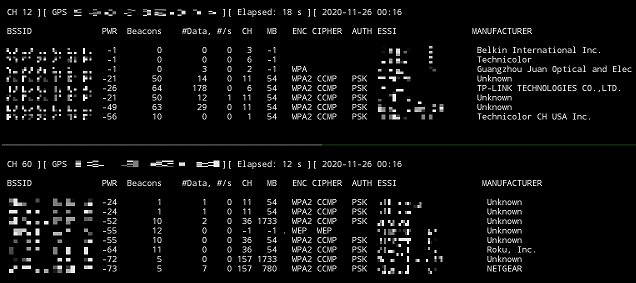

# Portable Wifi Scanning

Turns a Raspberry Pi device into a portable wifi recon unit that can be used for war walking and war driving.


## Description

This project was developed to simplify the proccess of creating a system that can be used for wireless recon.  The goal of this project is to:

 1. Simplify the installation and configuration of services (networkd-systemd, gpsd, ntpd, etc.)
 2. Install and configure packages and software used for wireless recon (aircrack-ng, kismet, etc.)
 3. Make it portable and easy to carry

This configuration creates a management access point using the onboard wifi allowing specific devices to connect to via SSH and to monitor web interfaces from tools such as bettercap and kismet.

The GPS device not only provides location data for access points collect, but it also acts as the ntp source for the unit.  This ensures that all data collect is accurately timestamped, for example when capturing first and last seen times.

The image below shows how the onboard and external hardware are utilized and tools installed as part of this project.


Updates have been made to this project to simplify the installation process and upgrade packages and configurations to utilize the latest Raspbian OS.

## Requirements

### Hardware


- [Alfa AWUS036ACH AC1200](https://www.amazon.com/Alfa-Long-Range-Dual-Band-Wireless-External/dp/B00VEEBOPG/ref=sr_1_3?dchild=1&keywords=alfa+ac1200&qid=1605960056&sr=8-3)
- [GlobalSat BU-353-S4](https://www.amazon.com/GlobalSat-BU-353-S4-USB-Receiver-Black/dp/B008200LHW/ref=sr_1_1?crid=2U82TWJSJ50JS&dchild=1&keywords=bu353s4&qid=1605960073&sprefix=bu+353%2Caps%2C165&sr=8-1)
- [Raspberry Pi 4 Model B](https://www.adafruit.com/product/4564)
- Protable battery capable of running the Pi and all the USB devices
- Raspberry Pi case
- Micro SD Card
- Laptop

### Operating System

- [Raspberry Pi OS (preferred)](https://www.raspberrypi.com/software/)
- [Kali ARM, raspberrypi](https://www.kali.org/get-kali/#kali-arm)

### Drivers

This drive is required to support the Alfa AWUS036ACH AC1200 wireless cards.

- [lwfinger/rtw88](https://github.com/lwfinger/rtw88)

## Installation

It is recommended to unplug all external devices (wireless cards, gps unit, etc.) prior to installation.

1. From a computer, download and install the [Raspberry PI Imager](https://www.raspberrypi.com/software/)
2. Choose the target device, operating system (raspbian lite perferred), set the username and password, and select the target storage device.  Once statisified with the selections, flash the image.
3. When complete, eject the flash card, insert into the Rasbperry Pi, and turn on.
4. SSH into the device using the credentials set in Step 2.  Verify that the device has internet connectivity.
5. Download this repository
6. Update the following variables in `config/variables.sh` script (Search for `CHANGE_ME`) to match your setup:
   - `WLAN_INTERFACE_AC1200_1`: Predictable name for TP-LINK wifi adapter (*wlxaabbccddffgg*)
   - `WLAN_INTERFACE_AC1200_2`: Predictable name for TP-LINK wifi adapter (*wlxaabbccddffgg*)
   - `MAC_ETH0`: MAC Address for eth0 (*AA:BB:CC:DD:EE:FF:GG*)
   - `MAC_WLAN0`: MAC Address for wlan0 (*AA:BB:CC:DD:EE:FF:GG*)
   - `AP_ESSID`: Access Point name
   - `AP_WPA_PASSPHRASE`: Access Point phassphrase
   - `MGMT_INTERFACE`: Wireless device name (e.g. wlan0)
   - `BASE_USER_NAME`: User name specified during OS installation
7. The following files need to be updated under the `config` directory
   - hostapd.accept: Allowed MAC addressed (one MAC address per line)
   - wpa_supplicant.conf: Wireless networks to connect to
8. Run the installer as root: `sudo ./install.sh`
9. When complete, review the output for any errors.  Make corrections as needed.
10. When the install is complete, press `y` to shutdown the Pi

At this point you can plug in the USB devices and power on the device.  If successful, you should see the access point in the wireless network list on your devices.

## Usage

### Running airodump-ng

This project was initially designed to run airodump-ng for wireless recon.

1. Change to root and change directory to `wifi_scanning_tools

   ```bash
   sudo su -
   cd /root/wifi_scanning_tools
   ```

2. Execute the `run_airodump.sh` script

   ```bash
   ./run_airodump.sh start
   ```

3. Attach to the tmux session

   ```bash
   tmux a
   ```

   

4. To stop the recon

   ```bash
   ./run_airodump.sh stop
   ```

## Important Notes

1. The rtl88 drivers will need to reinstalled when the kernel is updated.  Failure to do this will result in the Alfa cards no longer worked.  Pay close attention to the output of `apt install` to monitor for changes to the kernel.
2. A udev rule is configured to detect when the GPS device is ready and will start `gpsd.service`.  The udev rule may need to modified to match the specific parameters of your GPS device.

   - Parameters to Modified: idVendor, idProduct

      ```bash
      udevadm info -a -n /dev/ttyUSB0
      ```

3. New Wireless and Bluetooth devices may initally be blocked by the raspian OS.  This will prevent them from working.  Run `rfkill` to identify the blocked devices and to unblock them.

   ```bash
   rfkill list

   rfkill unblock <id of blocked device>
   ```

## Enhancements

1. Make a permanent storage area for the components to sit ontop of the truck body.  

   

## Useful Resources

Resources that helped to understand the different configuration options available for services used

- [hostapd configuration file](https://w1.fi/cgit/hostap/plain/hostapd/hostapd.conf)
- [systemd.unit — Unit configuration](https://www.freedesktop.org/software/systemd/man/systemd.unit.html)
- [Termux Touch Keyboard](https://wiki.termux.com/wiki/Touch_Keyboard)
- [Setting up a wireless LAN via the command line](https://www.raspberrypi.org/documentation/configuration/wireless/wireless-cli.md)
- [Set time from GPS dongle](http://blog.petrilopia.net/linux/raspberry-pi-set-time-gps-dongle/)
- [NTP error "...exceeds tolerance..."](https://access.redhat.com/solutions/35640)